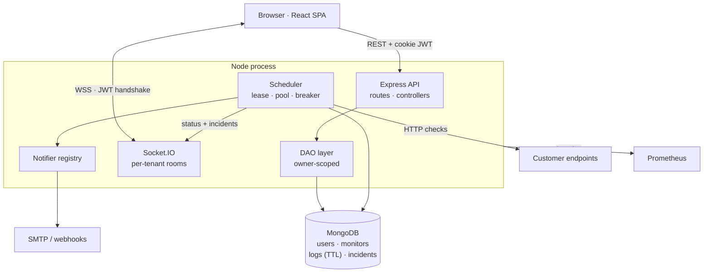
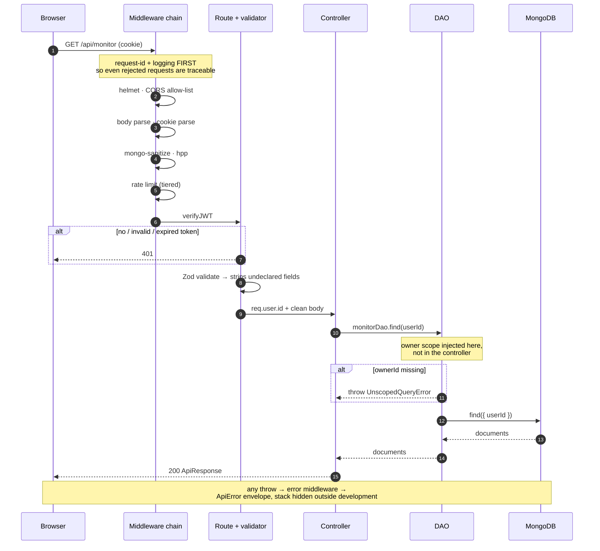
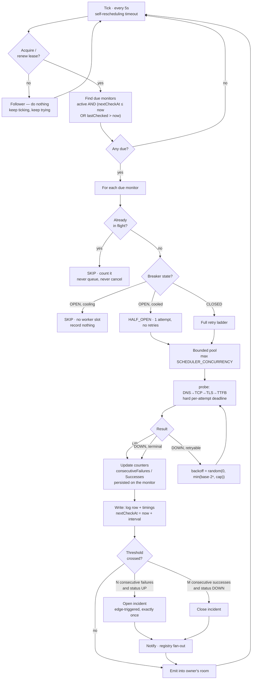
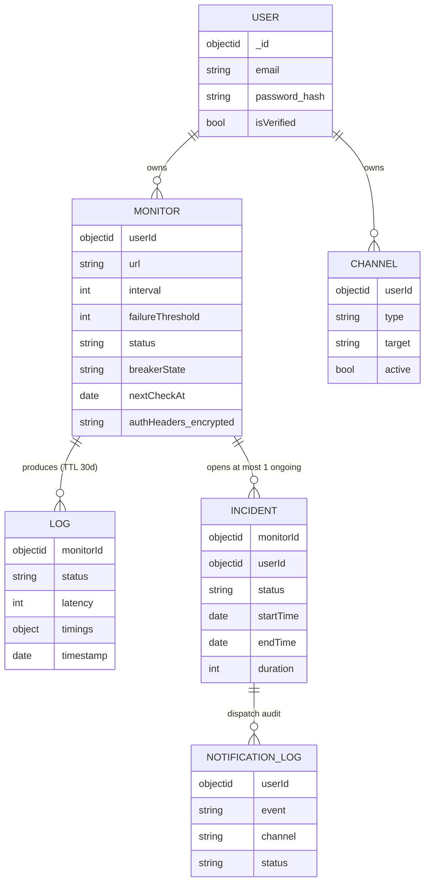
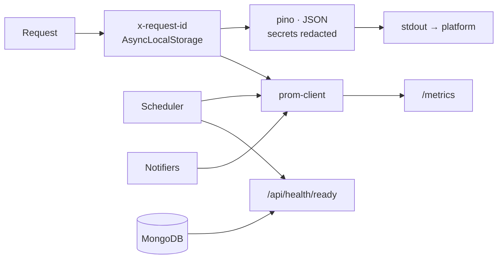
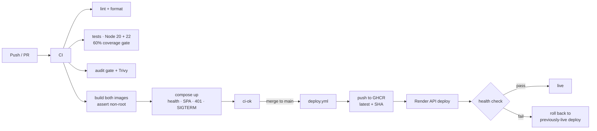

# Architecture

How WatchTower is put together and why. For the reasoning behind individual
choices see [`adr/`](adr/); for operating it see [`RUNBOOK.md`](RUNBOOK.md); for
the scheduler's full behavioural contract see [`SCHEDULER.md`](SCHEDULER.md).

---

## 1. Shape of the system

One Node process serves three things: the REST API, the Socket.IO server, and
the built React SPA. The scheduler runs inside that same process, gated by a
leader lease so only one instance polls.

**Why one process.** The SPA is served by the API from `public/dist`, so there
is no CORS in production, no second deployment, and the auth cookie is
same-origin by construction. The cost is that the API and the scheduler share a
CPU: a slow scheduler tick can add latency to requests. Acceptable at this size
and reversible — `SCHEDULER_ENABLED=false` turns any instance into an API-only
replica without a code change.

---

## 2. Request flow

Every authenticated request passes through the same chain. The order is not
arbitrary; each position is load-bearing.

**Correlation before security.** The request-id and access logger are the first
middleware, ahead of helmet and CORS. A request rejected by the path blocklist
still needs to appear in the logs with an id — a 403 nobody can correlate is a
log line nobody can act on.

**Sanitisation after parsing, before routing.** `express-mongo-sanitize` and
`hpp` need the parsed body and query to exist, and must run before any route
reads them. Both libraries reassign `req.query`, which is getter-only in Express
5, so a shim makes the slot writable — see `app.middleware.js`.

**Validation strips, it does not just check.** Zod schemas are an allow-list:
the parsed result is written back over `req.body`, so a field the schema does not
declare never reaches a controller. That is the outer layer; the DAO stamping
ownership is the inner one, and neither relies on the other being correct.

**The DAO is where tenancy lives.** Controllers pass an owner id; they cannot
construct an unscoped query. The original data-exposure defect was possible
because tenancy was enforced by convention in every controller — which works
until someone forgets once. See [ADR 0004](adr/) context and `SECURITY.md` T1.

---

## 3. Scheduler execution

The product's actual work. Full contract in [`SCHEDULER.md`](SCHEDULER.md).

### The properties worth knowing

**Skip, never queue.** A monitor slower than its own interval is skipped, not
backlogged. Queueing piles load onto a target that is already struggling and
every queued check is stale on arrival; cancelling throws away the measurement
in progress, which *is* the signal. Skips are counted so lag is observable.

**No catch-up stampede.** After downtime every monitor is overdue. Each is
checked *once* and rescheduled from now — never one check per missed interval,
which would fire a thundering herd at every customer simultaneously at the
moment the system is least healthy.

**Durable scheduling state.** `nextCheckAt` and the flap counters live on the
monitor document, so a restart mid-streak resumes rather than restarting the
threshold. Nothing is written until a check completes, so an interrupted check
leaves no partial state.

**Monotonic durations, wall-clock deadlines.** Durations use
`process.hrtime.bigint()` so an NTP step cannot produce a negative latency.
Persisted times are wall-clock because that is what "checked at 14:32" means. A
backward clock jump is detected via `lastChecked > now` and re-anchors the
schedule.

**The breaker protects the pool, not the data.** While open, no check runs and
**nothing is recorded** — we do not fabricate `DOWN` rows for checks we never
performed, because that would corrupt the uptime denominator. The consequence is
a genuine gap in the series for a long-dead endpoint, which is strictly better
than invented data.

---

## 4. Data model

**Indexes that carry weight**

| Index | Purpose |
|---|---|
| `monitors { active, nextCheckAt }` | The scheduler's hot query, every tick |
| `logs { monitorId, timestamp: -1 }` | Every dashboard query; without it, full scans |
| `logs { timestamp }` TTL 30d | Bounds growth; matches the widest uptime window |
| `incidents { monitorId }` unique, partial `status: ONGOING` | Makes a duplicate open **impossible**, not merely improbable |
| `scheduler_locks { expiresAt }` TTL | Garbage collection only — correctness is the query comparison |

**Two status fields, deliberately.** `status` is the *confirmed* state, debounced
by the flap thresholds and always in step with incidents. `lastCheckStatus` is
the raw result of the most recent check. Without both, the dashboard either lies
during a failure streak or contradicts the incident list.

---

## 5. Tenancy

Every tenant boundary is enforced in one of three places, never by a controller
remembering:

| Surface | Mechanism |
|---|---|
| REST | DAO injects the owner filter; missing owner **throws** |
| REST by-id | 404 for both "missing" and "not yours" — a 403 confirms the id exists |
| Realtime | Room derived from the verified token; no client-controlled join |
| Aggregations | Owner `$match` forced into the **first** pipeline stage |
| Writes | `create()` stamps ownership from the session; body `userId` ignored |

Logs and incidents carry no owner field of their own and are scoped through
monitor ownership. That costs one extra query and is correct for rows written
before the denormalisation existed — a `userId` scope would have silently hidden
every historical row from its rightful owner.

---

## 6. Observability

The request id propagates through `AsyncLocalStorage`, so a log line emitted
deep in the DAO carries the id of the request that caused it without any
function taking a `requestId` parameter.

**Liveness never touches a dependency.** `/api/health` is static; a liveness
probe that checks the database restarts every replica during a database outage,
turning a recoverable failure into a crash loop. `/api/health/ready` does check
— MongoDB with a real ping, plus the scheduler heartbeat — and returns 503 so a
broken replica leaves the load balancer while staying alive to recover.

**The scheduler heartbeat is the metric that matters.** A stopped scheduler is
this product's defining silent failure: the API answers, dashboards render the
last known state, and nobody is told their service is down. Nothing outside the
process can detect it.

---

## 7. Deployment

The rollback target is captured *before* anything changes — a rollback target
that moves is not a rollback target. A run that rolled back still reports
failure: a rollback is not a successful deploy.

Images are multi-stage, non-root, with `dumb-init` as PID 1. That last detail is
load-bearing: `npm start` does not forward SIGTERM, so the graceful shutdown
that drains in-flight checks and releases the scheduler lease never ran in a
container until it was fixed.

---

## 8. Known architectural limits

Stated here rather than discovered later.

| Limit | Consequence | Where it goes |
|---|---|---|
| Active/passive scheduling | Replicas scale the API, not the checking | Partitioned scheduling ([ADR 0004](adr/0004-mongodb-ttl-distributed-lock.md)) |
| MongoDB for time-series | ~10× storage overhead; 30d aggregation ceiling | TimescaleDB ([ADR 0002](adr/0002-mongodb-for-time-series.md)) |
| Single checking region | Cannot distinguish "target down" from "we can't reach it" | Multi-region probes |
| Lease, not fencing | A partitioned leader may overlap briefly | Tolerable: checks are idempotent |
| Socket.IO sticky sessions | Polling fallback needs sticky routing to scale out | Redis adapter |
| No SSRF allow-list | Monitors can probe internal addresses | DNS-time IP filtering (`SECURITY.md` T9) |
